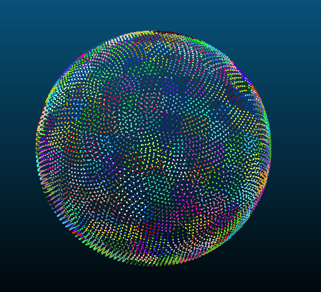

## Description

This repository contains some useful functions for processing point cloud, which uses GPU to get better performance. We provide python bindings for these functions.

## How to build

### 1. Dependency

* CUDA
* Boost-Python
* FLANN(built with CUDA)

### 2. Revise CMakeLists.txt

Set following 6 variables according to your installation directory.

```cmake
set(BOOST_PYTHON_INCLUDE_DIR /home/liuyuan/software/boost/include)      # path contains boost/python/object_core
set(BOOST_PYTHON_LIBRARY_DIR /home/liuyuan/software/boost/lib)          # path contains boost/python/libboost_numpy*

set(FLANN_INCLUDE_DIR /usr/local/include)   # path contains flann/flann.h
set(FLANN_LIBRARY_DIR /usr/local/lib)       # path contains libflann.so*

# !!! note the python here should be consistent with the python used for building boost-python
set(PYTHON_INCLUDE_DIRS /home/liuyuan/anaconda3/include/python3.6m)   # path contains Python.h
set(PYTHON_LIBRARIES /home/liuyuan/anaconda3/lib/libpython3.6m.so)
```

### 3. Build

```bash
mkdir build
cd build
cmake ..
make -j
```

### 4. test

```bash
cd test
python test_downsample.py
```

If the program output "cost xxxxx.xxxx s ", then the lib is built successfully. The downsampled point clouds are saved in the test/output directory as two txt files, whic can be visualized by CloudCompare or other tools. The result may look like this:



## Some API

still under construction

```python
def gridDownsampleGPU(pts,sample_stride,output_gidxs=False,gpu_id=0):
    '''
    split space into voxels, which have side length of sample_stride, 
    and retain only one point every voxel.
    Known issue: the space of point cloud should be smaller than 2^15*sample_stride, otherwise it will cause overflow in the computation.
    :param pts:				np.array, shape is [pn,fn] fn must >= 3, which are [x,y,z,(r,g,b,intensity,label,...)]
    :param sample_stride: 	float,
    :param output_gidxs: 	bool, whether output the grid idx for each raw point
    :param gpu_id:			int, which gpu to use
    :return: 
    	ds_idx: np.array [ds_pn] int32
    	(optional: grid_idx: np.array [pn] int32)
    	downsampled point clouds: ds_pts=pts[ds_idx]
    '''
```